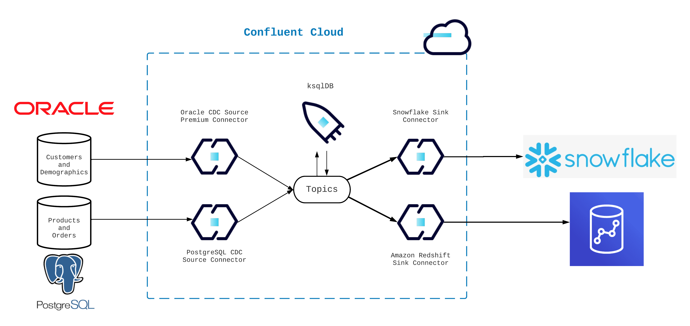

<div align="center" padding=25px>
    
</div>

# <div align="center">Change Data Capture with Confluent Cloud</div>

## <div align="center">Workshop & Lab Guide</div>

## Background

Confluent delivers a modern approach to break down data silos with streaming data pipelines and enables organizations with fully governed real-time data flows that can be shaped into multiple contexts while in motion, so different teams can gain self-service access to find, browse, create, share and reuse data, wherever and whenever it’s needed.
Enterprises can take advantage of Confluent’s real-time change data capture (CDC) capabilities to continuously intercept changes to the database as streams, combine, enrich and analyze it with other data streams while in motion, even before it reaches at-rest systems like the database or data warehouse, enabling engineers to build applications directly on the data pipeline and expand its use to more real-time use cases. In addition, by continuously synchronizing change data across multiple systems automatically, organizations can use Confluent’s CDC capabilities to power data infrastructure and application modernization initiatives. By enabling multiple applications and systems across the organization to have a consistent, up-to-date view of data, Confluent helps enterprises unlock the full value of their data, allowing it to have a network effect.
By promoting data reusability, engineering agility and greater collaboration and trust, more teams can confidently do more with their data and bring data products to market faster.

This demo walks you through building streaming data pipelines with Confluent Cloud. You'll learn about:

- Confluent’s fully managed PostgresSQL CDC Source and Oracle CDC Source Premium connectors to stream products, orders, customers, and demographics data in real time to Confluent Cloud
- ksqlDB to process and enrich data in real time, generating a unified view of customers’ shopping habits
- Snowflake and Amazon Redshift Sink connectors to load the enriched data into data warehouses for subsequent analytics and reporting

To learn more about Confluent’s solution, visit the [Data Warehouse streaming pipelines page](https://www.confluent.io/use-case/data-warehouse/).

---

## Architecture Diagram

This demo utilizes two fully-managed source connectors (Oracle CDC Source Premium and PostgreSQL CDC Source) and two fully-managed sink connectors (Snowflake and Amazon Redshift).

<div align="center"> 
  
</div>

---

# Requirements

In order to successfully complete this demo you need to install few tools before getting started.

> **Note:** This demo was built and validate on a Mac (x86).

- `git`
- Docker
- Terraform
  - Special instructions for Apple M1 users are [here](./terraform/running-terraform-on-M1.md)
- Install Confluent Cloud CLI by following the instructions [here](https://docs.confluent.io/confluent-cli/current/install.html).
- Python 3.9.x

## Prerequisites

### Confluent Cloud

1. Sign up for a Confluent Cloud account [here](https://www.confluent.io/get-started/).
1. After verifying your email address, access Confluent Cloud sign-in by navigating [here](https://confluent.cloud).
1. When provided with the _username_ and _password_ prompts, fill in your credentials.

   > **Note:** If you're logging in for the first time you will see a wizard that will walk you through the some tutorials. Minimize this as you will walk through these steps in this guide.

### Oracle Database

- This demo uses an Oracle Standard Edition database hosted on AWS that is publicly accessible.

### Snowflake

- Create a free account on Snowflake [website](https://www.snowflake.com/en/).
- Your account must reside in the same region as your Confluent Cloud environment. This demo is configured for `aws-us-west-2`.

---

## Setup

This demo uses Terraform and bash scripting to create and teardown infrastructure and resources.

1. Clone and enter this repo.

   ```bash
   git clone https://github.com/confluentinc/demo-change-data-capture.git
   cd demo-change-data-capture
   ```

1. Create a file to manage all the values you'll need through the setup.

   ```bash
    CONFLUENT_CLOUD_EMAIL=<replace>
    CONFLUENT_CLOUD_PASSWORD=<replace>

    CCLOUD_API_KEY=api-key
    CCLOUD_API_SECRET=api-secret
    CCLOUD_BOOTSTRAP_ENDPOINT=kafka-cluster-endpoint

    ORACLE_USERNAME=admin
    ORACLE_PASSWORD=demo-cdc-c0nflu3nt!
    ORACLE_ENDPOINT=oracle-endpoint
    ORACLE_PORT=1521

    POSTGRES_PRODUCTS_ENDPOINT=postgres-products
    REDSHIFT_ADDRESS=redshift-address

    SF_PVT_KEY=snowflake-private-key

    export TF_VAR_confluent_cloud_api_key="<replace>"
    export TF_VAR_confluent_cloud_api_secret="<replace>"

    export SNOWFLAKE_USER="tf-snow"
    export SNOWFLAKE_PRIVATE_KEY_PATH="../snowflake/snowflake_tf_snow_key.p8"
    export SNOWFLAKE_ACCOUNT="YOUR_ACCOUNT_LOCATOR"
   ```

   > **Note:** Run `source .env` at any time to update these values in your terminal session. Do NOT commit this file to a GitHub repo.

### Confluent Cloud

1. Create Confluent Cloud API keys by following [this](https://registry.terraform.io/providers/confluentinc/confluent/latest/docs/guides/sample-project#summary) guide.

   > **Note:** This is different than Kafka cluster API keys.

1. Update the `.env` file for the following variables with your credentials.

   ```bash
    CONFLUENT_CLOUD_EMAIL=<replace>
    CONFLUENT_CLOUD_PASSWORD=<replace>
    export TF_VAR_confluent_cloud_api_key="<replace>"
    export TF_VAR_confluent_cloud_api_secret="<replace>"
   ```

### Snowflake

1. Navigate to the Snowflake directory.

   ```bash
   cd demo-change-data-capture/snowflake
   ```

1. Create an RSA key for Authentication. This creates the private and public keys we use to authenticate the service account we will use for Terraform.
   ```bash
   openssl genrsa 2048 | openssl pkcs8 -topk8 -inform PEM -out snowflake_tf_snow_key.p8 -nocrypt
   openssl rsa -in snowflake_tf_snow_key.p8 -pubout -out snowflake_tf_snow_key.pub
   ```
1. Log in to the Snowflake console and create the user account by running the following command as the `ACCOUNTADMIN` role.

   But first:

   - Copy the text contents of the `snowflake_tf_snow_key.pub` file, starting after the PUBLIC KEY header, and stopping just before the PUBLIC KEY footer.
   - Paste over the RSA_PUBLIC_KEY_HERE label (shown below).

1. Execute both of the following SQL statements to create the User and grant it access to the `SYSADMIN` and `SECURITYADMIN` roles needed for account management.

   ```sql
   CREATE USER "tf-snow" RSA_PUBLIC_KEY='RSA_PUBLIC_KEY_HERE' DEFAULT_ROLE=PUBLIC MUST_CHANGE_PASSWORD=FALSE;
   GRANT ROLE SYSADMIN TO USER "tf-snow";
   GRANT ROLE SECURITYADMIN TO USER "tf-snow";
   ```

   > **Note:** We grant the user `SYSADMIN` and `SECURITYADMIN` privileges to keep the lab simple. An important security best practice, however, is to limit all user accounts to least-privilege access. In a production environment, this key should also be secured with a secrets management solution like Hashicorp Vault, Azure Key Vault, or AWS Secrets Manager.

1. Run the following to find the `YOUR_ACCOUNT_LOCATOR` and your Snowflake Region ID values needed.

   ```sql
   SELECT current_account() as YOUR_ACCOUNT_LOCATOR, current_region() as YOUR_SNOWFLAKE_REGION_ID;
   ```

   > **Note:** If your Snowflake account isn't in AWS-US-West-2 refer to [doc](https://docs.snowflake.com/en/user-guide/admin-account-identifier#snowflake-region-ids) to identify your account locator.

1. Update your `.env` file and add the newly created credentials for the following variables

   ```bash
   export SNOWFLAKE_USER="tf-snow"
   export SNOWFLAKE_PRIVATE_KEY_PATH="../snowflake/snowflake_tf_snow_key.p8"
   export SNOWFLAKE_ACCOUNT="YOUR_ACCOUNT_LOCATOR"
   ```

1. The `tf-snow` user account will be used by Terraform to create the following resources in Snowflake. All these resources will be deleted at the end of the demo when we run `terraform apply -destroy`. However, `tf-snow` won't get deleted.

   - A new user account named `TF_DEMO_USER` and a new public and private key pair.
   - A warehouse named `TF_DEMO`.
   - A database named `TF_DEMO`.
   - All permissions needed for the demo.

   For troubleshooting or more information review the [doc](https://quickstarts.snowflake.com/guide/terraforming_snowflake/index.html?index=..%2F..index#2).

1. Source the `.env` file.

   ```
   cd demo-change-data-capture
   source .env
   ```

### Build your cloud infrastructure

1. Log into your AWS account through command line.

1. Navigate to the repo's terraform directory.

   ```bash
   cd terraform
   ```

1. Initialize Terraform within the directory.
   ```bash
   terraform init
   ```
1. Create the Terraform plan.
   ```bash
   terraform plan -out=myplan
   ```
1. Apply the plan to create the infrastructure.

   ```bash
   terraform apply myplan
   ```

   > **Note:** Read the `main.tf` configuration file [to see what will be created](./terraform/main.tf).

1. Write the output of `terraform` to a JSON file. The `env.sh` script will parse the JSON file to update the `.env` file.

   ```bash
   terraform output -json > ../resources.json
   ```

   > **Note:** _Verify that the `resources.json` is created at root level of demo-change-data-capture directory._

1. Run the `env.sh` script.
   ```bash
   ./env.sh
   ```
1. This script achieves the following:

   - Creates an API key pair that will be used in connectors' configuration files for authentication purposes.
   - Updates the `.env` file to replace the remaining variables with the newly generated values.

### Prepare the Database for Change Data Capture

1. Run the following Python script to create and populate `DEMOGRAPHICS` and `CUSTOMERS` tables, as well as enable Change Data Capture (CDC) on those tables.

   ```bash
   python3 oracle/prepare_database.py
   ```

1. Take a moment to inspect the files in the `oracle` directory to understand what just happened.

---

# Demo

## Configure Source Connectors

Confluent offers 120+ pre-built [connectors](https://www.confluent.io/product/confluent-connectors/), enabling you to modernize your entire data architecture even faster. These connectors also provide you peace-of-mind with enterprise-grade security, reliability, compatibility, and support.

### Automated Connector Configuration File Creation

You can use Confluent Cloud CLI to submit all the source connectors automatically.

1. Run a script that uses your `.env` file to generate real connector configuration json files from the example files located in the `confluent` folder.

   ```bash
   cd demo-change-data-capture/connect
   ./create_connector_files.sh
   ```

### Configure Source Connectors

You can create the connectors either through CLI or Confluent Cloud web UI.

<details>
    <summary><b>CLI</b></summary>

1. Log into your Confluent account in the CLI.

   ```bash
   confluent login --save
   ```

1. Use your environment and your cluster.

   ```bash
   confluent environment list
   confluent environment use <your_env_id>
   confluent kafka cluster list
   confluent kafka cluster use <your_cluster_id>
   ```

1. Run the following commands to create Oracle and PostgreSQL CDC Source connectors.

   ```bash
   cd demo-change-data-capture/connect
   confluent connect cluster create --config-file actual_oracle_cdc.json.json
   confluent connect cluster create --config-file actual_postgres_products_source.json
   ```

</details>
<br>

<details>
    <summary><b>Confluent Cloud Web UI</b></summary>

1. Log into Confluent Cloud by navigating to https://confluent.cloud
1. Step into **Demo_Change_Data_Capture** environment.
1. If you are promoted with **Unlock advanced governance controls** screen, click on **No thanks, I will upgrade later**.
   > **Note:** In this demo, the Essential package for Stream Governance is sufficient. However you can take a moment and review the differences between the Esstentials and Advanced packages.
1. Step into **demo_kafka_cluster**.
1. On the navigation menu, select **Connectors** and then **+ Add connector**.
1. In the search bar search for **Oracle** and select the **Oracle CDC Source Premium connector** which is a fully-managed connector.
1. Create a new Oracle CDC Source Premium connector and complete the required fields using `actual_oracle_cdc.json` file.
1. Now search for and add a **Postgres CDC Source connector** using `actual_postgres_products_source.json` file.

</details>
<br>

Once both are fully provisioned, check for and troubleshoot any failures that occur. Properly configured, each connector begins reading data automatically.

---

## ksqlDB

If all is well, it's time to transform and join your data using ksqlDB. Ensure your topics are receiving records first.

All queries are available on ksqldb_queries.sql [file](./ksqldb_queries.sql).

1. Navigate to Confluent Cloud web UI and then go to ksqlDB cluster.

1. Change `auto.offset.reset = earliest`.

1. Use the editor to execute the following queries.

1. Use the following statements to consume `demographics` records.

   ```sql
    CREATE OR REPLACE STREAM demographics_composite (
        struct_key STRUCT<ID VARCHAR> KEY,
        ID VARCHAR,
        STREET_ADDRESS VARCHAR,
        STATE VARCHAR,
        ZIP_CODE VARCHAR,
        COUNTRY VARCHAR,
        COUNTRY_CODE VARCHAR
    )WITH (KAFKA_TOPIC = 'ORCL.ADMIN.DEMOGRAPHICS', KEY_FORMAT='JSON',VALUE_FORMAT = 'JSON_SR');
   ```

1. Verify `demographics_composite` stream is populated correctly and then hit **Stop**.

   ```sql
   SELECT * FROM demographics_composite EMIT CHANGES;
   ```

1. The type for the key field in `demographics_composite` is a `STRUCT`. To keep things simple we want to flat that field and then create a table. We'll achieve both by running the following query

   ```sql
    CREATE TABLE demographics WITH (KAFKA_TOPIC='demographics', KEY_FORMAT='JSON',VALUE_FORMAT='JSON_SR') AS
    SELECT
        id,
        LATEST_BY_OFFSET(street_address) street_address,
        LATEST_BY_OFFSET(state) state,
        LATEST_BY_OFFSET(zip_code) zip_code,
        LATEST_BY_OFFSET(country) country,
        LATEST_BY_OFFSET(country_code) country_code
        FROM demographics_composite
        GROUP BY id
    EMIT CHANGES;
   ```

1. Verify `demographics` table is populated correctly and then hit **Stop**.

   ```sql
   SELECT * FROM demographics;
   ```

1. Notice how the key field differs from `demographics_composite` stream.

1. Repeat the same process for `customers`.

   ```sql
   CREATE OR REPLACE STREAM customers_composite (
       struct_key STRUCT<ID VARCHAR> KEY,
       ID VARCHAR,
       FIRST_NAME VARCHAR,
       LAST_NAME VARCHAR,
       EMAIL VARCHAR,
       PHONE VARCHAR
   )WITH (KAFKA_TOPIC = 'ORCL.ADMIN.CUSTOMERS', KEY_FORMAT='JSON',VALUE_FORMAT = 'JSON_SR');

    CREATE TABLE customers WITH (KAFKA_TOPIC='customers', KEY_FORMAT='JSON', VALUE_FORMAT='JSON_SR') AS
    SELECT
        id,
        LATEST_BY_OFFSET(first_name) first_name,
        LATEST_BY_OFFSET(last_name) last_name,
        LATEST_BY_OFFSET(email) email,
        LATEST_BY_OFFSET(phone) phone
    FROM customers_composite
    GROUP BY id
    EMIT CHANGES;
   ```

1. You can now join `customers` and `demographics` by customer ID to create an up-to-the-second view of each record.

   ```sql
    CREATE TABLE customers_enriched WITH (KAFKA_TOPIC='customers_enriched',KEY_FORMAT='JSON', VALUE_FORMAT='JSON_SR') AS
        SELECT
            c.id id, c.first_name, c.last_name, c.email, c.phone,
            d.street_address, d.state, d.zip_code, d.country, d.country_code
        FROM customers c
        JOIN demographics d ON d.id = c.id
    EMIT CHANGES;
   ```

1. Verify `customers_enriched` stream is populated correctly and then hit **Stop**.

   ```sql
   SELECT * FROM customers_enriched EMIT CHANGES;
   ```

1. Next you will capture your `products` records and convert the record key to a simpler value.

   ```sql
    CREATE STREAM products_composite (
        struct_key STRUCT<product_id VARCHAR> KEY,
        product_id VARCHAR,
        `size` VARCHAR,
        product VARCHAR,
        department VARCHAR,
        price VARCHAR
   ) WITH (KAFKA_TOPIC='postgres.products.products', KEY_FORMAT='JSON', VALUE_FORMAT='JSON_SR', PARTITIONS=1, REPLICAS=3);
   ```

   ```sql
    CREATE STREAM products_rekeyed WITH (
        KAFKA_TOPIC='products_rekeyed',
        KEY_FORMAT='JSON',
        VALUE_FORMAT='JSON_SR'
    ) AS
        SELECT
            product_id,
            `size`,
            product,
            department,
            price
        FROM products_composite
    PARTITION BY product_id
   EMIT CHANGES;
   ```

1. Verify `products_rekeyed` stream is populated correctly and then hit **Stop**.
   ```sql
   SELECT * FROM products_rekeyed EMIT CHANGES;
   ```
1. Create a ksqlDB table to show the most up-to-date values for each `products` record.

   ```sql
    CREATE TABLE products WITH (
    KAFKA_TOPIC='products',
    KEY_FORMAT='JSON',
    VALUE_FORMAT='JSON_SR'
    ) AS
        SELECT
            product_id,
            LATEST_BY_OFFSET(`size`) `size`,
            LATEST_BY_OFFSET(product) product,
            LATEST_BY_OFFSET(department) department,
            LATEST_BY_OFFSET(price) price
        FROM products_rekeyed
        GROUP BY product_id
    EMIT CHANGES;
   ```

1. Verify the `products` table is populated correctly.

   ```sql
   SELECT * FROM products;
   ```

1. Follow the same process using the `orders` data.

   ```sql
    CREATE STREAM orders_composite (
        order_key STRUCT<`order_id` VARCHAR> KEY,
        order_id VARCHAR,
        product_id VARCHAR,
        customer_id VARCHAR
   ) WITH (
        KAFKA_TOPIC='postgres.products.orders',
        KEY_FORMAT='JSON',
        VALUE_FORMAT='JSON_SR'
   );
   ```

   ```sql
    CREATE STREAM orders_rekeyed WITH (
        KAFKA_TOPIC='orders_rekeyed',
        KEY_FORMAT='JSON',
        VALUE_FORMAT='JSON_SR'
    ) AS
        SELECT
            order_id,
            product_id,
            customer_id
        FROM orders_composite
    PARTITION BY order_id
   EMIT CHANGES;
   ```

1. Verify `orders_rekeyed` stream is populated correctly and then hit **Stop**.
   ```sql
   SELECT * FROM orders_rekeyed EMIT CHANGES;
   ```
1. You're now ready to create a ksqlDB stream that joins these tables together to create enriched order data in real time.
   ```sql
    CREATE STREAM orders_enriched WITH (
    KAFKA_TOPIC='orders_enriched',
    KEY_FORMAT='JSON',
    VALUE_FORMAT='JSON_SR'
    ) AS
        SELECT
            o.order_id AS `order_id`,
            p.product_id AS `product_id`,
            p.`size` AS `size`,
            p.product AS `product`,
            p.department AS `department`,
            p.price AS `price`,
            c.id AS `customer_id`,
            c.first_name AS `first_name`,
            c.last_name AS `last_name`,
            c.email AS `email`,
            c.phone AS `phone`,
            c.street_address AS `street_address`,
            c.state AS `state`,
            c.zip_code AS `zip_code`,
            c.country AS `country`,
            c.country_code AS `country_code`
        FROM orders_rekeyed o
            JOIN products p ON o.product_id = p.product_id
            JOIN customers_enriched c ON o.customer_id = c.id
    PARTITION BY o.order_id
    EMIT CHANGES;
   ```
1. Verify `orders_enriched` stream is populated correctly and then hit **Stop**.

   ```sql
   SELECT * FROM orders_enriched EMIT CHANGES;
   ```

   > **Note:** We need a stream to 'hydrate' our data warehouse once the sink connector is set up.

1. Now we want to create a rewards table. Let's say we want to immediately notify our customers once they unlock a new status. We can easily do so by creating a table which is again updated in real time based on customer's purchases.

   ```sql
    CREATE TABLE rewards_status WITH(KAFKA_TOPIC='rewards_status',
    KEY_FORMAT='JSON',
    VALUE_FORMAT='JSON_SR') AS
    SELECT
        `customer_id`,
        `email`,
        SUM(`price`) AS `total`,
        CASE
        WHEN SUM(`price`) > 400 THEN 'GOLD'
        WHEN SUM(`price`) > 300 THEN 'SILVER'
        WHEN SUM(`price`) > 200 THEN 'BRONZE'
        ELSE 'CLIMBING'
        END AS `reward_level`
    FROM orders_enriched
    GROUP BY `customer_id`, `email`;

   ```

1. Verify `rewards_status` table is populated correctly and then hit **Stop**.

   ```sql
   SELECT * FROM rewards_status;
   ```

1. We can either stream this data to an external system by leveraging a connector or we can write a producer that will publish updates (for example an in-app notifications). The sky is the limit!

---

## Data Warehouse Connectors

You're now ready to sink data to Snowflake and Amazon Redshift.

You can create the connectors either through CLI or Confluent Cloud web UI.

<details>
    <summary><b>CLI</b></summary>

1. Log into your Confluent account in the CLI.

   ```bash
   confluent login --save
   ```

1. Use your environment and your cluster.

   ```bash
   confluent environment list
   confluent environment use <your_env_id>
   confluent kafka cluster list
   confluent kafka cluster use <your_cluster_id>
   ```

1. Run the following command to create Snowflake Sink connector

   ```bash
   cd demo-change-data-capture
   confluent connect cluster create --config-file connect/actual_snowflake_sink.json
   confluent connect cluster create --config-file connect/actual_redshift_sink.json
   ```

</details>
<br>

<details>
    <summary><b>Confluent Cloud Web UI</b></summary>

1. Log into Confluent Cloud by navigating to https://confluent.cloud
1. Step into **Demo_Change_Data_Capture** environment.
1. Step into **demo_kafka_cluster**.
1. On the navigation menu, select **Connectors** and then **+ Add connector**.
1. In the search bar search for **Snowflake** and select the **Snowflake Sink** which is a fully-managed connector.
1. Create a new connector and complete the required fields using `actual_snowflake_sink.json` file.
1. Repeat the same process and add **Amazon Redshift Sink** connector and complete the required fields using `actual_redshift_sink.json` file.

</details>
<br>

---

## Verifying results in data warehouses

Once the connectors are fully provisioned, check for and troubleshoot any failures that occur. Properly configured, each connector begins reading data automatically.

### Snowflake

1. Log into your Snowflake account.
1. Create a new worksheet or use an existing one.
1. Run the following commands

   ```sql
   USE ROLE TF_DEMO_SVC_ROLE;
   USE WAREHOUSE TF_DEMO;
   ALTER WAREHOUSE TF_DEMO RESUME;
   USE DATABASE TF_DEMO;

   SELECT * FROM "TF_DEMO"."PUBLIC".ORDERS_ENRICHED LIMIT 100;
   ```

1. You can flatten data in Snowflake if you wish. Use [Snowflake's documentation](https://docs.snowflake.com/en/user-guide/json-basics-tutorial-query.html). You can also query JSON data directly in Snowflake by naming the column and specifying columns of interest. For example:

   ```sql
   SELECT RECORD_CONTENT:email FROM "TF_DEMO"."PUBLIC".ORDERS_ENRICHED LIMIT 100;
   ```

   > **Note**: To things simple in this demo `TF_DEMO_SVC_ROLE` is given `SECURITYADMIN` level permissions. However, you should always follow best practices in production environment.

### Amazon Redshift

---

## CONGRATULATIONS

Congratulations on building your streaming data pipelines for realtime data warehousing scenario in Confluent Cloud! Your complete pipeline should resemble the following one.


---

# Teardown

You want to delete any resources that were created during the demo so you don't incur additional charges.

## Infrastructure

1. Run the following command to delete all connectors

   ```bash
   cd demo-change-data-capture
   ./teardown_connectors.sh
   ```

1. Run the following command to delete all resources created by Terraform
   ```bash
   terraform apply -destory
   ```

### Snowflake

If you created a Terraform user in Snowflake solely to run this lab, you can remove them.

1. Log into Snowflake account and use a worksheet to delete `tf-snow` by running
   ```sql
   DROP USER "tf-snow";
   ```

---

## Useful Links

- Learn more about change data capture [here](https://www.confluent.io/learn/change-data-capture/)
- Learn more about Streaming Data Pipelines [here](https://www.confluent.io/streaming-data-pipelines/)
- Try more demos:
  - Real-time data warehousing https://github.com/confluentinc/demo-realtime-data-warehousing
  - Streaming Data Pipelines to Cloud Databases https://github.com/confluentinc/demo-database-modernization
  - Stream Designer, Confluent's visual canvas for rapidly building, testing, and deploying streaming data pipelines powered by Kafka https://github.com/confluentinc/demo-current-stream-designer
  - Application Modernization https://github.com/confluentinc/demo-application-modernization
